# Vue
[참고](#참고)
## Onboarding
서버에서 데이터를 받아와 DOM을 직접 수정하는 AJAX 방식. 데이터 바뀔 때마다 매번 DOM 요소를 찾아 수정하기보다 편한 방법 없을까?
<ul>
<li>Vue를 통한 자동화</li>
<li>데이터가 바뀌면 UI는 어떠해야 한다 선언 </li>
<li>데이터가 바뀌면 화면이 알아서 바뀌는 Vue의 반응성. 더이상 DOM 조작에 신경X</li>
</ul>

## Frontend Development

웹사이트와 웹 애플리케이션의 사용자 인터페이스(UI)와 사용자 경험(UX)를 만들고 디자인하는 것. (HTML, CSS, JavaScript 등 활용)

- Client-side frameworks
    - 클라이언트 측에서 UI와 상호작용을 개발하기 위해 사용되는 JavaScript 기반 프레임워크
    - UI 효율적 만들기 위해 미리 짜놓은 코드의 뼈대. 부품단위 개발
    - 동적 웹사이트가 주로 사용. 대표적으로 Vue, React, Angular 있음. 

- Client-side frameworks의 필요성
    - 무언가를 읽는 곳에서 -> 무언가를 하는 곳으로 변화
    - 다루는 데이터가 많아짐 (일관성있고 안정적인 업데이트)
    - 동적이고 반응적인 웹 애플리케이션 개발(실시간 데이터 업데이트)
    - 코드 재사용성 증가(컴포넌트 기반, 모듈화된 코드구조)
    - 개발 생산성 향상(강력한 개발 도구)

- Single Page Application (SPA)
    - 단일 페이지에서 동작하는 웹 애플리케이션
    - 하나의 HTML 파일 위에서 JavaScript가 필요한 부분만 교체
    - 페이지 이동 없이 동작. 빠르고 부드러운 사용자 경험

- SPA 작동원리
    - 최초 로드 시 어플리케이션에 필요한 주요 리소스를 다운로드
    - 페이지 갱신에 대해 필요한 데이터만을 비동기적으로 전달 받아 화면의 필요한 부분만 동적으로 갱신 ( AJAX와 같은 기술 사용하여 필요한 데이터만 비동기적으로 로드)
    - JavaScript를 사용하여 클라이언트 측에서 동적으로 콘텐츠를 생성하고 업데이트(CSR방식)

- Client Side Rendering (CSR)
    - 클라이언트에서 콘텐츠를 렌더링하는 방식
    - 빈 집(HTML)에서 가구(JavaScript)를 배송받아 직접 조립하는 방식
    - 브라우저는 거의 텅 빈 HTML 과 JavaScript 파일 받아온 후 JavaScript가 실행되어 데이터를 요청하고, 화면을 동적으로 완성

- CSR 작동 원리
    - 사용자가 웹사이트에 요청 보냄
    - 서버는 최소한의 HTML과 JavaScript 파일을 클라이언트로 전송
    - 클라이언트는 HTML과 JavaScript 다운 받음
    - 브라우저가 JavaScript 실행하여 동적으로 페이지 콘텐츠를 생성
    - 필요한 데이터는 API 통해 서버로부터 비동기적으로 가져옴
    - (이후 서버는 더이상 HTML 제공하지 않고 요청에 필요한 데이터만 응답)

- CSR과 SPA 장점
    - 빠른 페이지 전환 (페이치 최초 로드 이후 필요한 데이터만 가져와 페이지 일부만 렌더링, 서버로 전송되는 데이터 양 최소화)
    - 사용자 경험, Frontend와 Backend 명확히 분리

- CSR과 SPA 단점
    - 느린 초기 로드 속도, SEO(검색엔진 최적화) 문제

## Vue
사용자 인터페이스를 구축하기 위한 JavaScript 프론트엔드 프레임워크

컴포넌트로 화면 조립, 데이터 바뀌면 화면도 자동으로 바뀌는 반응성이 가장 큰 특징

Vue의 핵심 기능: 선언적 렌더링, 반응성

Component: 재사용 가능한 코드 블록. UI를 독립적이고 재사용 가능한 일부분으로 분할하고 각부분을 개별적으로 다룸. 중첩된 Component의 트리 형태

## Vue 사용 방법

1. CDN 방식
Vue Application 생성하기

1-1. CDN 작성

1-2. application instance

전역 Vue 객체 불러옴. 구조분해할당 문법으로 Vue 객체의 createApp 함수를 할당

모든 Vue application은 createApp 함수로 새 application instance를 생성하는 것으로 시작함

1-3. Root Component
createApp 함수에는 객체(컴포넌트)가 전달됨. 

모든 App에는 다른 컴포넌트들을 하위 컴포넌트로 포함할 수 있는 Root 컴포넌트가 필요.

1-4. Mounting the App
HTML 요소에 Vue application instance를 연결. 각 앱 인스턴스에 대해 mount()는 한 번만 호출 가능

1-5. setup() 함수
컴포넌트 동작 전 미리 준비하는 시작점. 이 함수 안에서 데이터를 정의, 화면에 표시할 값 계산, 각종 로직 준비

2. NPM 설치 방식

## 반응형 상태
ref(): 반응형 상태를 선언하는 함수

일반 JavaScript 변수를 Vue가 변화를 감지할 수 있는 반응형 객체로 래핑하여 반환. 

컴포넌트 내에서 변하는 값의 상태를 추적 관리하기 위해 사용.

ref로 선언된 변수의 값이 변경되면 해당 값을 사용하는 템플릿에서 자동으로 업데이트

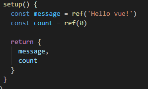
템플릿의 참조에 접근하려면 setup함수에서 선언 및 반환 필요.

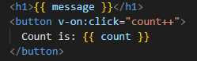
편의상 템플릿에서 사용시 .value 작성 불필요

## Vue 기본 구조

- createApp()에 전달되는 객체는 Vue 컴포넌트. 
    - 컴포넌트의 상태는 setup() 함수 내에서 선언되어야 하며 객체를 반환해야 함.

- 템플릿 렌더링
    - 반환된 객체의 속성은 템플릿에서 사용 가능. {{}} 사용 메시지 값을 기반으로 동적 텍스트를 렌더링.
    - 유효한 JavaScript 표현식 사용 가능

- Event Listeners in Vue

    - v-on directive 사용하여 DOM 이벤트를 수신. 함수 내에서 반응형 변수 변경하여 업데이트

## Template Syntax
- 데이터 바인딩: UI와 데이터 간의 자동적인 동기화를 의미. 데이터가 변경되면 이를 UI에 자동으로 반영하고 UI에서의 변경도 데이터에 자동으로 반영되게 함.

템플릿 문법 종류 4가지 : Text Interpolation / Raw HTML / Attribute Bindings / JavaScript Expressions

1. Text Interpolation
    - 데이터 바인딩의 기본. 
    - 콧수염 구문 {{ }} 사용하여 HTML 템플릿 내에 JavaScript 변수나 식을 삽입
    
    - 기본적으로 텍스트 삽입 시 사용, 값은 자동으로 HTML로 변환되지 않음.
    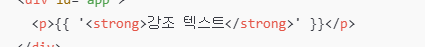
    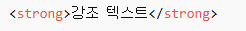

2. Raw HTML
    - 콧수염 구문에서는 HTML 태그를 포함해도 문자열로 취급함. 
    - 실제 HTML을 출력하기 위해 v-html 사용
    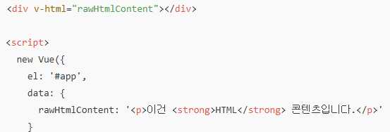

3. Attribute Bindings
    - HTML 속성 내에서 사용하기 위해 v-bind 사용
    - HTML의 속성 값을 vue의 속성과 동기화 되도록 함
    - 바인딩 값이 null 이거나 undefined인 경우 해당 속성은 렌더링 요소에서 제거
    
    

4. JavaScript Expressions
    - 템플릿 내에서 JavaScript 코드를 직접 실행하여 그 결과를 UI에 반영
    - 각 바인딩에는 하나의 단일 표현식만 포함될 수 있음

## Directive
'v-' 접두사가 있는 특수 속성
- DOM 요소에 특정 반응형 동작을 적용하는 명령어
- JavaScript의 로직을 HTML 템플릿 안에서 선언적으로 사용하여 코드를 깔끔하고 직관적으로 유지하는 데 도움을 주는 Vue의 강력한 도구

Directive 전체 구문

구조: name : argument . modifiers = "value" 
- name: directive의 핵심 이름. 기능 종류 의미
- argument: 무엇에 대해 동작할지 구체적 대상
- modifiers: 점으로 표시되는 접미사. 기본 동작을 수정. 여러 수식어 이어서 사용 가능.
- value: directive에 연결될 javascript 표현식

구문 종류: v-bind, v-if, v-for, v-on ...

1. v-bind
HTML 태그의 속성을 Vue 데이터와 실시간으로 연결해 동적으로 제어하는 Directive. 데이터 값에 따라 이미지, 스타일, 클래스 등 자유롭게 변경 가능

- Attribute Bindings 속성 바인딩
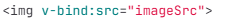
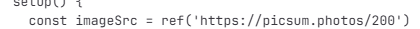
    - v-bind shorthand 약어. :을 사용
    
    - 동적 인자 이름. 대괄호로 감싸서 사용. 소문자만 가능
    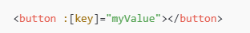
    v-bind 약어. 버튼 태그의 속성을 제어. key라는 인자를 찾아서 myValue로 변경해줌. 

- Class and Style Bindings 클래스와 스타일 바인딩
    - class 및 style 속성 값을 v-bind로 사용할 때 객체 또는 배열을 활용하여 작성할 수 있도록 함.

    - 객체를 :class에 전달하여 클래스 동적 전환
    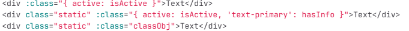
    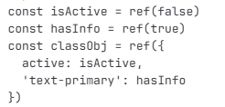
    3가지 방식.

    - 배열을 :class에 바인딩하여 클래스 목록 적용
    
    

    - 객체를 :style로 style 속성에 바인딩
    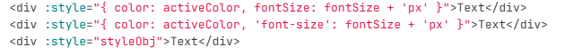
    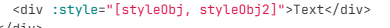
    

2. v-on
dom 요소에 이벤트 리스너를 연결 및 수신.
약어는 @

v-on:event="handler"

@event="handler"

@click="danger('인자')"   

클릭하면 danger라는 함수를 실행

Inline handlers 와 Method Handlers

- event modifiers
    - 함수 실행 시 event.prevent.Default()같은 거 메서드 내에 직접 작성할 필요 없이 click.stop.prevent 방식으로 작성 가능

3. v-model
input 같은 폼 요소의 값과 Vue데이터를 실시간으로 동기화

사용자의 입력이 즉시 데이터에 반영, 데이터 변경이 즉시 화면에 반영되는 양방향 연결을 만들어줌.
## 참고
- ref 객체
    - 변수 변형 감지를 위해 참조 자료형의 객체 타입으로 구현. (일반 변수는 감지 불가)

    - ref는 값 바뀌면 화면 자동 업데이트, 일반변수는 값 바뀌어도 화면 갱신X

- 템플릿 unwrap 주의
    - unwrap은 ref가 setup에서 반환된 객체의 최상위 속성인 경우에만 적용. 
    - 해결하려면 원하는 속성을 객체에서 분해하여 최상위 속성으로 만들어줌.

