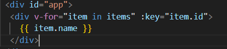

# Vue
<details><summary>Vue Basic Syntax 01</summary>
[참고](#참고)
## Onboarding
서버에서 데이터를 받아와 DOM을 직접 수정하는 AJAX 방식. 데이터 바뀔 때마다 매번 DOM 요소를 찾아 수정하기보다 편한 방법 없을까?
<ul>
<li>Vue를 통한 자동화</li>
<li>데이터가 바뀌면 UI는 어떠해야 한다 선언 </li>
<li>데이터가 바뀌면 화면이 알아서 바뀌는 Vue의 반응성. 더이상 DOM 조작에 신경X</li>
</ul>

## Frontend Development

웹사이트와 웹 애플리케이션의 사용자 인터페이스(UI)와 사용자 경험(UX)를 만들고 디자인하는 것. (HTML, CSS, JavaScript 등 활용)

- Client-side frameworks
    - 클라이언트 측에서 UI와 상호작용을 개발하기 위해 사용되는 JavaScript 기반 프레임워크
    - UI 효율적 만들기 위해 미리 짜놓은 코드의 뼈대. 부품단위 개발
    - 동적 웹사이트가 주로 사용. 대표적으로 Vue, React, Angular 있음. 

- Client-side frameworks의 필요성
    - 무언가를 읽는 곳에서 -> 무언가를 하는 곳으로 변화
    - 다루는 데이터가 많아짐 (일관성있고 안정적인 업데이트)
    - 동적이고 반응적인 웹 애플리케이션 개발(실시간 데이터 업데이트)
    - 코드 재사용성 증가(컴포넌트 기반, 모듈화된 코드구조)
    - 개발 생산성 향상(강력한 개발 도구)

- Single Page Application (SPA)
    - 단일 페이지에서 동작하는 웹 애플리케이션
    - 하나의 HTML 파일 위에서 JavaScript가 필요한 부분만 교체
    - 페이지 이동 없이 동작. 빠르고 부드러운 사용자 경험

- SPA 작동원리
    - 최초 로드 시 어플리케이션에 필요한 주요 리소스를 다운로드
    - 페이지 갱신에 대해 필요한 데이터만을 비동기적으로 전달 받아 화면의 필요한 부분만 동적으로 갱신 ( AJAX와 같은 기술 사용하여 필요한 데이터만 비동기적으로 로드)
    - JavaScript를 사용하여 클라이언트 측에서 동적으로 콘텐츠를 생성하고 업데이트(CSR방식)

- Client Side Rendering (CSR)
    - 클라이언트에서 콘텐츠를 렌더링하는 방식
    - 빈 집(HTML)에서 가구(JavaScript)를 배송받아 직접 조립하는 방식
    - 브라우저는 거의 텅 빈 HTML 과 JavaScript 파일 받아온 후 JavaScript가 실행되어 데이터를 요청하고, 화면을 동적으로 완성

- CSR 작동 원리
    - 사용자가 웹사이트에 요청 보냄
    - 서버는 최소한의 HTML과 JavaScript 파일을 클라이언트로 전송
    - 클라이언트는 HTML과 JavaScript 다운 받음
    - 브라우저가 JavaScript 실행하여 동적으로 페이지 콘텐츠를 생성
    - 필요한 데이터는 API 통해 서버로부터 비동기적으로 가져옴
    - (이후 서버는 더이상 HTML 제공하지 않고 요청에 필요한 데이터만 응답)

- CSR과 SPA 장점
    - 빠른 페이지 전환 (페이치 최초 로드 이후 필요한 데이터만 가져와 페이지 일부만 렌더링, 서버로 전송되는 데이터 양 최소화)
    - 사용자 경험, Frontend와 Backend 명확히 분리

- CSR과 SPA 단점
    - 느린 초기 로드 속도, SEO(검색엔진 최적화) 문제

## Vue
사용자 인터페이스를 구축하기 위한 JavaScript 프론트엔드 프레임워크

컴포넌트로 화면 조립, 데이터 바뀌면 화면도 자동으로 바뀌는 반응성이 가장 큰 특징

Vue의 핵심 기능: 선언적 렌더링, 반응성

Component: 재사용 가능한 코드 블록. UI를 독립적이고 재사용 가능한 일부분으로 분할하고 각부분을 개별적으로 다룸. 중첩된 Component의 트리 형태


## Vue 사용 방법

1. CDN 방식
Vue Application 생성하기

1-1. CDN 작성


1-2. application instance

전역 Vue 객체 불러옴. 구조분해할당 문법으로 Vue 객체의 createApp 함수를 할당


모든 Vue application은 createApp 함수로 새 application instance를 생성하는 것으로 시작함

1-3. Root Component
createApp 함수에는 객체(컴포넌트)가 전달됨. 

모든 App에는 다른 컴포넌트들을 하위 컴포넌트로 포함할 수 있는 Root 컴포넌트가 필요.

1-4. Mounting the App
HTML 요소에 Vue application instance를 연결. 각 앱 인스턴스에 대해 mount()는 한 번만 호출 가능


1-5. setup() 함수
컴포넌트 동작 전 미리 준비하는 시작점. 이 함수 안에서 데이터를 정의, 화면에 표시할 값 계산, 각종 로직 준비


2. NPM 설치 방식


## 반응형 상태
ref(): 반응형 상태를 선언하는 함수

일반 JavaScript 변수를 Vue가 변화를 감지할 수 있는 반응형 객체로 래핑하여 반환. 

컴포넌트 내에서 변하는 값의 상태를 추적 관리하기 위해 사용.

ref로 선언된 변수의 값이 변경되면 해당 값을 사용하는 템플릿에서 자동으로 업데이트


템플릿의 참조에 접근하려면 setup함수에서 선언 및 반환 필요.


편의상 템플릿에서 사용시 .value 작성 불필요

## Vue 기본 구조

- createApp()에 전달되는 객체는 Vue 컴포넌트. 
    - 컴포넌트의 상태는 setup() 함수 내에서 선언되어야 하며 객체를 반환해야 함.

- 템플릿 렌더링
    - 반환된 객체의 속성은 템플릿에서 사용 가능. {{}} 사용 메시지 값을 기반으로 동적 텍스트를 렌더링.
    - 유효한 JavaScript 표현식 사용 가능

- Event Listeners in Vue

    - v-on directive 사용하여 DOM 이벤트를 수신. 함수 내에서 반응형 변수 변경하여 업데이트

## Template Syntax
- 데이터 바인딩: UI와 데이터 간의 자동적인 동기화를 의미. 데이터가 변경되면 이를 UI에 자동으로 반영하고 UI에서의 변경도 데이터에 자동으로 반영되게 함.

템플릿 문법 종류 4가지 : Text Interpolation / Raw HTML / Attribute Bindings / JavaScript Expressions

1. Text Interpolation
    - 데이터 바인딩의 기본. 
    - 콧수염 구문 {{ }} 사용하여 HTML 템플릿 내에 JavaScript 변수나 식을 삽입
    
    - 기본적으로 텍스트 삽입 시 사용, 값은 자동으로 HTML로 변환되지 않음.
    
    

2. Raw HTML
    - 콧수염 구문에서는 HTML 태그를 포함해도 문자열로 취급함. 
    - 실제 HTML을 출력하기 위해 v-html 사용
    

3. Attribute Bindings
    - HTML 속성 내에서 사용하기 위해 v-bind 사용
    - HTML의 속성 값을 vue의 속성과 동기화 되도록 함
    - 바인딩 값이 null 이거나 undefined인 경우 해당 속성은 렌더링 요소에서 제거
    
    

4. JavaScript Expressions
    - 템플릿 내에서 JavaScript 코드를 직접 실행하여 그 결과를 UI에 반영
    - 각 바인딩에는 하나의 단일 표현식만 포함될 수 있음

## Directive
'v-' 접두사가 있는 특수 속성
- DOM 요소에 특정 반응형 동작을 적용하는 명령어
- JavaScript의 로직을 HTML 템플릿 안에서 선언적으로 사용하여 코드를 깔끔하고 직관적으로 유지하는 데 도움을 주는 Vue의 강력한 도구

Directive 전체 구문

구조: name : argument . modifiers = "value" 
- name: directive의 핵심 이름. 기능 종류 의미
- argument: 무엇에 대해 동작할지 구체적 대상
- modifiers: 점으로 표시되는 접미사. 기본 동작을 수정. 여러 수식어 이어서 사용 가능.
- value: directive에 연결될 javascript 표현식

구문 종류: v-bind, v-if, v-for, v-on ...

1. v-bind
HTML 태그의 속성을 Vue 데이터와 실시간으로 연결해 동적으로 제어하는 Directive. 데이터 값에 따라 이미지, 스타일, 클래스 등 자유롭게 변경 가능

- Attribute Bindings 속성 바인딩


    - v-bind shorthand 약어. :을 사용
    
    - 동적 인자 이름. 대괄호로 감싸서 사용. 소문자만 가능
    
    v-bind 약어. 버튼 태그의 속성을 제어. key라는 인자를 찾아서 myValue로 변경해줌. 

- Class and Style Bindings 클래스와 스타일 바인딩
    - class 및 style 속성 값을 v-bind로 사용할 때 객체 또는 배열을 활용하여 작성할 수 있도록 함.

    - 객체를 :class에 전달하여 클래스 동적 전환
    
    
    3가지 방식.

    - 배열을 :class에 바인딩하여 클래스 목록 적용
    
    

    - 객체를 :style로 style 속성에 바인딩
    
    
    

2. v-on
dom 요소에 이벤트 리스너를 연결 및 수신.
약어는 @

v-on:event="handler"

@event="handler"

@click="danger('인자')"   


클릭하면 danger라는 함수를 실행

Inline handlers 와 Method Handlers

- event modifiers
    - 함수 실행 시 event.prevent.Default()같은 거 메서드 내에 직접 작성할 필요 없이 click.stop.prevent 방식으로 작성 가능

3. v-model
input 같은 폼 요소의 값과 Vue데이터를 실시간으로 동기화

사용자의 입력이 즉시 데이터에 반영, 데이터 변경이 즉시 화면에 반영되는 양방향 연결을 만들어줌.
## 참고
- ref 객체
    - 변수 변형 감지를 위해 참조 자료형의 객체 타입으로 구현. (일반 변수는 감지 불가)

    - ref는 값 바뀌면 화면 자동 업데이트, 일반변수는 값 바뀌어도 화면 갱신X

- 템플릿 unwrap 주의
    - unwrap은 ref가 setup에서 반환된 객체의 최상위 속성인 경우에만 적용. 
    - 해결하려면 원하는 속성을 객체에서 분해하여 최상위 속성으로 만들어줌.

</details>
<details><summary>Vue Basic Syntax 02</summary>

- [computed](#computed)
- [v-if, v-show, v-for](#v-if-v-show-v-for)
- [watch](#watch)
- [onMounted](#onMounted)

## computed
computed(): 계산된 속성을 정의하는 함수

미리 계산된 속성을 만들어 템플릿의 표현식을 단순하게 하고, 불필요한 반복 연산을 줄임.

한 번 계산된 값은 캐싱(임시 저장)되어, 의존하는 데이터가 바뀌기 전까지는 다시 계산하지 않아 성능에 유리.

templates 내에서 삼항연산자같은 거 쓰면 templates 복잡, 매번 계산 발생

```
const { createApp, ref, computed } = Vue

const restOfTodos = computed(() => {
    return todos.value.length > 0 ? '아직 남았다' : '퇴근!'
})
```
```
<h2>남은 할 일</h2>
<p>{ restOfTodos }</p> 
```

- 반응형 데이터를 포함하는 복잡한 로직의 경우 computed를 활용하여 미리 값을 계산하여 계산된 값 사용.
- 여러 곳 사용 시, computed로 정의된 restOfTodos를 필요한 곳마다 재사용 하면 됨.

### computed 특징

1. 반환되는 값은 계산된 ref(computed ref)이며, 일반 ref와 유사하게 계산된 결과를 .value로 참조 가능.(템플릿에서는 생략 가능)
2. computed 속성은 의존된 반응형 데이터를 자동 추적
3. 의존하는 반응형 데이터가 변경될 때만 재평가

(다시 짚기!)
- ref: 기본형 데이터를 반응형으로 만드는 Vue 함수
- computed ref: 원본 데이터가 바뀔 때만, 값을 알아서 다시 계산하는 ref

### computed와 method
차이
- computed 속성은 의존하는 반응형 데이터를 기반으로 그 결과를 캐시cached
- 의존하는 데이터가 변경되는 경우에만 자동 재평가
- 의존하는 데이터가 변경되지 않는 한 해당 computed 속성에 여러 번 접근해도 함수를 다시 실행하지 않고 캐시된 결과를 즉시 반환.


- method 호출은 렌더링 발생마다 함수를 실행
- method는 호출해야만 실행됨

- 템플릿에서 computed는 괄호 없이, method에서는 괄호 붙여 호출
- 계산에 인자가 필요하다면 method를 사용해야 함.


적절한 사용처
- computed
    - 의존하는 데이터에 따라 결과가 바뀌는 계산된 속성을 만들 때
    - 동일한 의존성을 가진 여러 곳에서 사용할 때 계산 결과 캐싱, 중복 계산 방지
- method
    - 단순 특정 동작 수행하는 함수 정의 시
    - 데이터에 의존하는지 여부와 관계없이 항상 동일한 결과 반환하는 경우


**캐시**

- 데이터나 결과를 일시적으로 저장해두는 임시 저장소. 시간 절약에 유리.
- 데이터 요청 시 먼저 캐시 확인 후 없다면 원본 데이터 접근하여 가져와 캐시에 저장

## v-if v-show v-for

### v-if
표현식 값이 true/false 기반으로 요소를 조건부로 렌더링. (사용 예시: 로그인 상태에 따라 다른 메뉴)

```
const isSeen = ref(true)

<p v-if="isSeen"> true일 때만 보여용 </p>
```

v-else 함께 사용
```
const isSeen = ref(true)
<p v-if="isSeen">true일 때 보임</p>
<p v-else>false 일 때 보여용</p>
<button @click="isSeen = !isSeen">토글</button>
```

v-else-if
```
<div v-if="name === 'Alice'"> Alice </div>
<div v-else-if="name === 'Bella'"> Bella </div>
<div v-else> 아무도 아님 </div>
```

- 여러 요소에 v-if 적용
    - template 요소에 v-if 를 적용. 여러 요소를 하나의 조건부 블록으로 묶을 수 있음.

### v-show
v-if와 유사. v-if는 DOM에서 요소를 완전히 제거하는 반면 v-show는 CSS의 display 속성을 none으로 바꿔 화면에서만 보이지 않게 숨김.

요소를 자주 보여주고 숨겨야하는 경우 렌더링 비용이 높은 v-if보다 v-show가 성능 유리.

- v-show는 항상 DOM에 렌더링 됨
- CSS display 속성만 전환하기 때문 (none 속성으로 변환)

```
const isShow = ref(false)
<div v-show="isShow">보이나?</div>

<div style="display:none;">스타일 디스플레이가 none </div>

```

적절한 사용처
- v-if
    - 초기 조건이 false 인 경우 아무 작업도 수행X
    - 토글 비용 높다
    - 실행 중 조건 변경 없으면 이득

- v-show
    - 초기 조건 관계 없이 항상 렌더링
    - 초기 렌더링 비용이 더 높음
    - 콘텐츠 자주 전환 시 이득 


### v-for
소스데이터 기반으로 배열Array나 객체Object의 데이터를 렌더링하는 반복문Directive.

상품 목록 등 동일한 구조의 요소를 여러 번 반복해서 화면에 표시할 때 사용.

```
<div v-for="item in items">
{{ item.text }}
</div>
```

객체는 key value 쌍. value, key, index 조합하여 순회
```
<div v-for="(item, index) in arr"></div>

<div v-for="value in object"></div>

<div v-for="(value,key) in object"></div>

<div v-for="(value,key,index) in object"></div>
```

HTML template 요소에 v-for 사용하여 하나 이상 요소 반복 렌더링 가능

- v-for과 key


어떤 요소가 어떤 데이터에 대응되는지 구분하기 위해 각 아이템을 고유하게 식별할 수 있는 값 key가 필요

반드시 v-for 과 key를 함께 사용한다.

- 권장되는 key: 데이터 베이스 고유ID, 항목 고유 식별자.
- 피해야 할 key: 배열 인덱스, 객체 자체

### v-for 과 v-if 함께 사용하기

객체나 리스트 속 데이터 순회하며 특정 조건 만족시키는 데이터 뽑아오고 싶은 경우.

v-if가 v-for보다 높은 우선순위 가지므로 v-for 범위 내의 데이터에서 v-if 를 사용할 수 없음.

>> 동일 요소에 v-for과 v-if를 함께 사용하면 안됨.

해결법!
1. computed 활용
```
const completeTodos = computed(() => {
    return todos.value.filter((todo) => !todo.isComplete)
    })

<ul>
    <li v-for="todo in completeTodos" :key="todo.id">
    {{ todo.name }}
    </li>
</ul>


```
2. v-for과 template 요소 활용

v-for과 template 요소 사용하여 v-if 위치 이동

```
<ul>
  <template v-for="todo in todos" :key="todo.id">
    <li v-if="!todo.isComplete">
    {{ todo.name }}
    </li>
  </template>
</ul>


```
## watch
watch()는 하나 이상의 반응형 데이터 감시, 변경되면 지정된 콜백 함수를 실행하는 기능. 

새로운 값을 계산하는 computed와 달리, watch는 데이터가 바뀔 때 특정 행동을 수행하기 위해 사용됨

- 구조
```
watch(source, (newValue, oldValue) => {
    //something
})
```
    - source: watch가 감시하는 대상
    - 두 번째 인자: callback 함수. 감시 대상 변화된 값, 기존 값

- 여러 source 감시하는 watch
    - 배열을 활용하여 여러 대상 감시 가능
    - 배열 속 ref 객체의 내부까지 감시하려면 {deep:true} 옵션 추가 설정

### computed와 watch
- 둘 다 데이터 변화를 감지하고 처리, 의존하는 원본 데이터 변경X
- computed는 의존하는 데이터 속성의 계산된 값을 반환 / watch는 특정 데이터 속성 변화를 감시하고 작업을 수행, 반환X 
- computed는 계산한 값 캐싱하여 재사용 및 중복 계산 방지 / watch는 데이터 변화에 따른 특정 작업 수행
- computed는 연산된 길이, 필터링 된 목록 계산 등 사용 / watch는 DOM 변경, 다른 비동기 작업 수행, 외부 API 연동 등 사용


## Lifecycle Hooks
Vue 컴포넌트가 생성되고 DOM에 마운트되고, 업데이트되고 , 소멸되는 각 생애 주기 단계에서 실행되도록 제공되는 함수.

주요 Lifecycle Hooks
- 생성 단계 / 마운트 단계 / 업데이트 단계 / 소멸 단계 등 다양한 단계 존재.
- 일반적으로 사용되는 것: onMounted, onUpdated, onUnmounted


1. Mounting
Vue 컴포넌트 인스턴스가 초기 렌더링 및 DOM 요소 생성 완료된 후 특정 로직 수행
2. Updated
반응형 데이터의 변경으로 인해 컴포넌트의 DOM이 업데이트 된 후 특정 로직 수행


### 참고
Vue Style Guide
- v-for에 key 작성 (우선순위 A)
- 동일 요소에 v-if 와 v-for 함께 사용하지 않기 (우선순위 A)


computed의 반환 값은 변경하지 말 것.

computed 사용 시 원본 배열 변경하지 말 것. (복사본 만들어 처리)

Lifecycle Hooks 는 동기적으로 작성해야 함.
</details>

<details>
<summary> Single File Components</summary>

## SFC

component: 웹 페이지를 구성하는 재사용 가능한 코드 블록. UI를 독립적이고 재사용 가능한 일부분으로 분할, 개별적으로 다룸.

애플리케이션은 중첩된 component의 트리 형태


single-file components: 컴포넌트의 템플릿, 로직 및 스타일을 하나의 파일로 묶어낸 특수한 파일 형식 (*.vue 파일)

SFC는 하나의 .vue 파일 안에 컴포넌트의 HTML, JavaScript, CSS 코드를 모두 담는 Vue의 개발 방식.

세 부분으로 나뉘어짐.
- template: 화면 구조 담당
- script: 로직 담당
- style: 스타일 담당

관련 코드가 한 곳에 모여 있어 컴포넌트 단위의 개발과 유지보수 용이

### SFC 구성요소
각 *.vue 파일은 세 가지 유형의 최상위 언어 블록 template. script, style로 구성됨.

언어 블록 작성 순서 상관 없지만 일반적으로 template -> script -> style 순서로 작성

1. template 블록
각 vue 파일은 최상위 template 블록 하나만 포함 가능

2. script setup 블록
- 각 vue 파일은 script setup 블록 하나만 포함 가능. (일반 script 제외) 
- 컴포넌트의 setup() 함수로 사용되며 컴포넌트의 각 인스턴스에 대해 실행
- 변수 및 함수는 동일한 컴포넌트의 템플릿에서 자동으로 사용 가능

3. style scoped 블록
- vue 파일에는 여러 style태그 포함 가능
- scoped가 지정되면 CSS는 현재 컴포넌트에만 적용됨

### Vite
프론트엔드 개발 도구. 빠른 개발 환경 위한 빌드 도구와 개발 서버 제공

Vite는 Vue 프론트엔드 개발을 위한 빌드 도구

- 개발 시에는 파일 필요할 때만 요청 -> 속도 높임
- 배포 시에는 최적화된 파일로 묶음(번들링)

Build
- 프로젝트의 소스 코드를 최적화하고 번들링하여 배포할 수 있는 형식으로 변환하는 과정
- 개발 중에 사용되는 여러 소스 파일 및 리소스를 최적화된 형태로 조합하여 최종 소프트웨어 제품을 생성하는 것

Vite는 이러한 빌드 프로세스를 수행하는 데 사용되는 도구

## Vue Project
1. 뷰 프로젝트 생성 (Vite 기반 빌드)

npm create vue@latest 

npm: node package manager
- 프로젝트명 설정
- 프로젝트에 추가할 설정 선택 (space로 중복 선택)
- 실험용 기능 선택
- 프로젝트 폴더로 이동 (cd vue-project)
- 패키지 설치 npm install
- Vue 프로젝트 서버 실행 npm run dev

### Node JS
브라우저 안에서만 동작할 수 있었던 JavaScript를 브라우저가 아닌 서버 측에서도 실행할 수 있게 함. (프론트와 백 동일 언어로 개발 가능)


NPM 활용해 수많은 오픈 소스 패키지와 라이브러리를 제공, 개발자들이 손쉽게 코드를 공유하고 재사용할 수 있게 함


## 모듈과 번들러

### Module
프로그램을 구성하는 독립적인 코드 블록 (*.js 파일)
개발하는 애플리케이션 크기가 커지고 복잡 >> 파일 여러 개로 분리하여 관리. 이 때 분리된 각 파일이 **모듈** (*.js 파일 하나 하나)

- Module 의 한계
    - 애플리케이션 발전 -> 처리해야하는 JavaScript 모듈 개수 극적 증가
    - 성능 병목 현상 발생, 모듈 간 의존성 깊어짐 >> 문제 발생 시 원인 파악 어려움
    - 복잡하고 깊은 모듈 간 의존성 문제를 해결하기 위한 도구 필요 >> Bundler

### Bundler
여러 모듈과 파일을 하나 혹은 여러 개의 번들로 묶고 최적화하여 사용할 수 있게 만들어주는 도구

- 여러 개로 나뉜 JavaScript 모듈 파일들을 하나의 파일로 합쳐주는 도구.
- 네트워크 부담 줄이고 코드를 브라우저가 이해할 수 있는 형태로 변환
- 웹사이트 로딩 속도 높이고 성능 최적화

역할 : 의존성 관리, 코드 최적화, 리소스 관리 등.
- Bundler가 하는 작업을 Bundling이라고 함
- Vite는 Rollup이라는 Bundler 사용하며 모두 설정해두고 있음.

## Vue Project 구조
1. public 디렉토리
- 주로 아래의 정적 파일을 위치시킴
    - 소스코드에서 참조되지 않는 코드
    - 항상 같은 이름 갖는 코드
    - import 필요 없는 코드
- 항상 root 절대 경로 사용하여 참조

2. src 디렉토리
- 프로젝트의 주요 소스 코드 포함
- 실제로 우리가 작업하게 될 대부분의 소스코드가 위치
- 컴포넌트, 스타일, 라우팅 등 프로젝트의 핵심 코드를 관ㄹ;

- src/assets
    - 프로젝트 내 사용되는 정적 자원 (이미지, 폰트, 스타일 시트) 관리
    - 컴포넌트 자체에서 참조하는 내부 파일 저장
    - 컴포넌트 아닌 곳에서는 public 디렉토리에 위치한 피알 사용

- src/components
    - 프로젝트 주요 소스 코드 포함하는 곳
    - 실제로 우리가 작업하는 대부분의 소스코드가 위치
    - 컴포넌트, 스타일, 라우팅 등 프로젝트 핵심 코드 관리

- src/App.vue
    - Vue 앱의 Root 컴포넌트
    - 다른 하위 컴포넌트들을 포함
    - 애플리케이션 전체 레이아웃과 공통적 요소를 정의

- src/main.js
    - Vue 앱 초기화, App.vue를 DOM에 마운트하는 시작점
    - 필요한 라이브러리 import 하고 전역설정 수행


3. index.html
- Vue 앱 기본 HTML 파일
- main.js에서 App.vue 컴포넌트 렌더링하고 index.html 특정 위치를 마운트시킴
- 필요한 스타일 시트, 스크립트 등 외부 리소스를 로드할 수 있음.

4. 기타 설정 파일
5. 패키지 관리 파일


## Vue Component 활용
1. 사전 준비
- 초기 생성된 모든 component 삭제. App.vue만 남겨둠
- App.vue 초기화. 태그만 남겨둠
2. 컴포넌트 파일 생성
- MyComponent.vue 파일 생성
- vb3s 자동완성, lang="scss" 삭제
3. 컴포넌트 등록
- App 컴포넌트에 MyComponent 등록
- App 부모 - MyComponent 자식 관계 형성
- @ : src/ 경로를 뜻하는 약어

### Virtual DOM
- Vue에서는 직접적으로 DOM에 접근하는 것을 권장하지 않음.
    - JS 에서 사용하는 DOM 접근 관련 메서드 사용 금지
    - querySelector, createElement, addEventListener 등

- Vue의 ref()와 Lifecycle Hooks 함수를 사용해 간접적으로 접근하여 조작할 것.
    - 성능과 코드의 예측 가능성을 극대화

>> 가상돔!

**Virtual DOM** : 가상의 DOM을 메모리에 저장하고 실제 DOM과 동기화하는 프로그래밍 개념 (Vue의 내부 렌더링 기술)

실제 DOM을 그대로 복사한, 메모리상에만 존재하는 '가상 설계도'

데이터 변경되면 Vue는 실제 DOM 건드리지 않고 가상 설계도 위에서 변경사항을 미리 시뮬레이션하고 차이점 계산

계산된 최소한의 변경 사항만 실제 DOM에 딱 한 번 적용 => 불필요한 렌더링 줄이고 성능 향상

장점: 효용성, 반응성, 추상화

- 직접 DOM 엘리먼트에 접근해야 하는 경우
    - ref 속성 사용하여 특정 DOM 엘리먼트에 직접적인 참조 얻을 수 있음
### 패키지 관리 주의사항
- npm install 입력 위치: 프로젝트 루트 디렉토리
- npm_modules 폴더: 필요시 npm install 통해 재생성 가능.(직접 수정, 관리 필요 없음)
- package.json과 package-lock.json 직접 편집 자제
- 문제 발생 시 node-modules폴더 삭제 후 다시 npm install
</details>